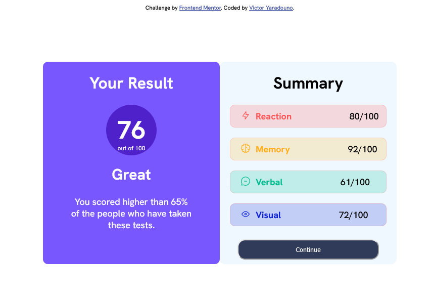

# Frontend Mentor - Results summary component solution

This is a solution to the [Results summary component challenge on Frontend Mentor](https://www.frontendmentor.io/challenges/results-summary-component-CE_K6s0maV). Frontend Mentor challenges help you improve your coding skills by building realistic projects. 

## Table of contents

- [Overview](#overview)
  - [The challenge](#the-challenge)
  - [Screenshot](#screenshot)
  - [Links](#links)
- [My process](#my-process)
  - [Built with](#built-with)
  - [What I learned](#what-i-learned)
  - [Continued development](#continued-development)
  - [Useful resources](#useful-resources)
- [Author](#author)
- [Acknowledgments](#acknowledgments)

**Note: Delete this note and update the table of contents based on what sections you keep.**

## Overview

This is a simple HTML and CSS project that displays a result summary component. The component shows the score of a test, and compares it to the scores of other test-takers.

### The challenge

Users should be able to:

- View the optimal layout for the interface depending on their device's screen size
- See hover and focus states for all interactive elements on the page

### Screenshot

Take a look at the sceenshot of my work here

### Links

- Solution URL: [If you want to see my solution, click on this link >>>](https://github.com/Victoryara/Result-Summary-Component)
- Live Site URL: [If you want to see the result on the browser](https://victoryara.github.io/Result-Summary-Component/)

## My process

### Built with

- HTML
- CSS 
- Flexbox

### What I learned

I  learnt how to use flexbox to align content and to make layout even though it was really hard trying to put things in to place.

### Continued development

I still need to improve with flexbox and also I need to implement grid for layout in my future project cause I think it's easier to create more complex layout with it and I could use flexbox to align items. Overall, I think I need to improve my css skills.

### Useful resources

- [Chat GPT](https://chat.openai.com/chat) - This helped me to use some properties so that my block should be displayed center by setting the position to fixed and  top and bottom to 50% and finally using the transform property to align them to the center.I'm not really sure if it's a good practice though.

## Author

- Website - [Victor Yaradouno](https://github.com/Victoryara)
- Frontend Mentor - [@Victoryara](https://www.frontendmentor.io/profile/Victoryara)
- Twitter - [@Victoryara2](https://twitter.com/VictorYara2)

## Acknowledgments
This project is based on a design from Frontend Mentor.
